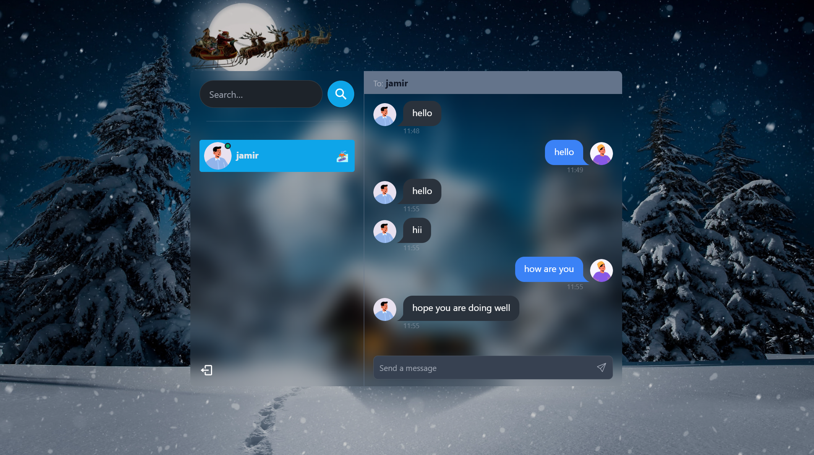
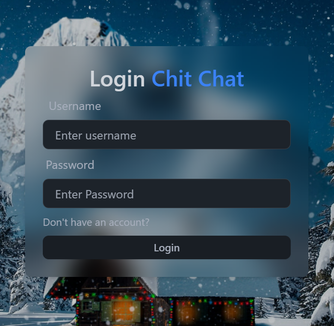
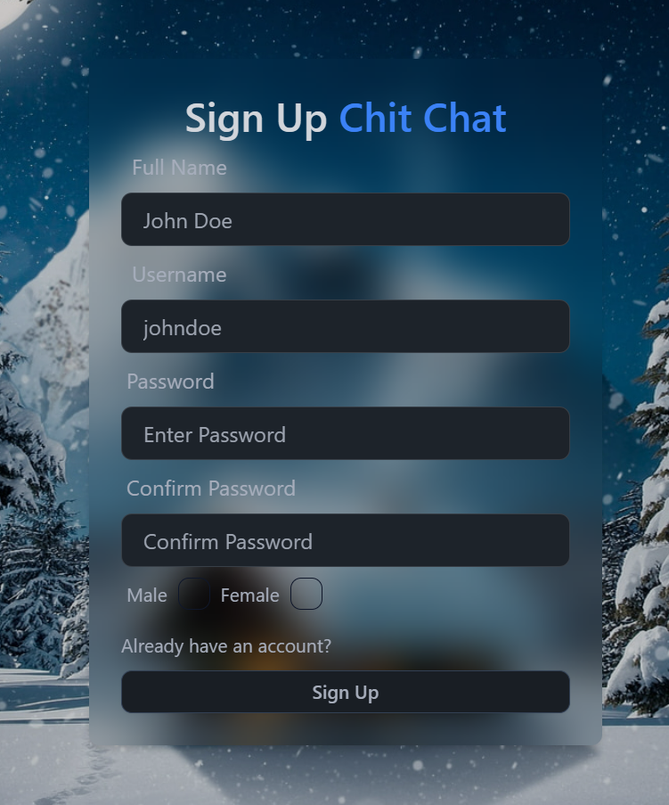

# Chit Chat is a chat app that connects users seamlessly!





<a href="https://my-chat-app-caeg.onrender.com/" target="_blank" rel="noopener noreferrer">Visit App</a

Some Features:

-   🌟 Tech stack: MERN + Socket.io + TailwindCSS + Daisy UI
-   🎃 Authentication && Authorization with JWT
-   👾 Real-time messaging with Socket.io
-   🚀 Online user status (Socket.io and React Context)
-   👌 Global state management with Zustand
-   🐞 Error handling both on the server and on the client
-   ⏳ And much more!

### Setup .env file

```js
PORT=...
MONGO_DB_URI=...
JWT_SECRET=...
NODE_ENV=...
```

### Build the app

```shell
npm run build
```

### Start the app

```shell
npm start
```
